<!-- BANNER -->

  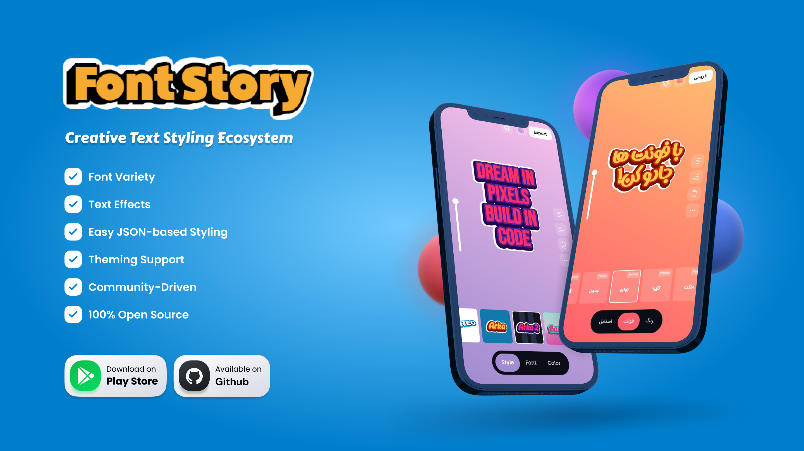

<h1 align="center">✨ Font Story ✨</h1>

<em>An open-source, fantasy-powered text styling ecosystem built with Flutter</em>

  
  
  
  
  
  
  

## 🌈 What is Font Story?

**Font Story** is a fully open-source Flutter app that gives you full creative control over text styling — with no hidden data, paywalls, or limitations.

Unlike typical design tools, Font Story is built for **transparency**, **extensibility**, and **pure creativity**. You can customize fonts, colors, shadows, gradients, and visual effects effortlessly — all through simple JSON files.  
No Flutter coding required.

Whether you're an artist, developer, or enthusiast, you can import and export presets, remix community styles, or create your own from scratch. Every part of Font Story is open for contribution — from style definitions and fonts to new features in the app itself.

> ✨ Unleash your creativity, style your text your way, and help make expressive typography accessible to everyone.

## 📲 Try It Now

| Platform       | Link                                                                 |
|----------------|----------------------------------------------------------------------|
| 📦 Google Play  | [Coming Soon](#) |
| 🌐 Web         | [Coming Soon](#)                        |
| 📁 APK         | [Download Latest APK](https://github.com/FontStory/font-story-app/releases/latest/download/app-release.apk) |

## ⚙️ Features

- 🖋️ **Font Variety** – Use unique fonts or import your own
- ✨ **Text Effects** – Add blur, shadows, outlines, glow & more
- 🎨 **Easy JSON-based Styling** – Define styles with a few lines of code
- 📤 **Import & Export** – Save and share presets instantly
- 🌈 **Theming Support** – Bright gradients or subtle tones? Your choice.
- 👥 **Community-Driven** – Open contributions welcomed
- 🔓 **100% Open Source** – No closed data or limits

## 📁 Repositories

| Repository               | Description                                               |
|--------------------------|-----------------------------------------------------------|
| [`font-story-app`](https://github.com/FontStory/font-story-app)   | The main Flutter app for text styling — runs on Android and the Web         |
| [`font-story-data`](https://github.com/FontStory/font-story-data) | Central repository for JSON-based styles, fonts, and community submissions  |

## ✨ Preview Styles

| 🍭 Kouman | 🍪 Oreo | 🌌 Arka | 🌠 Arka 2 | 💖 Barbie |
|----------|---------|--------|----------|------------|
| 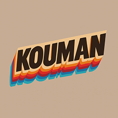 | 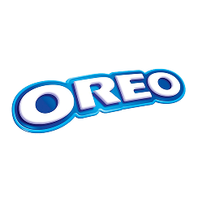 | 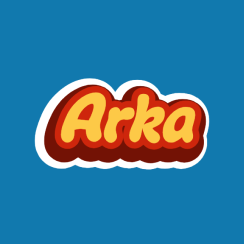 | 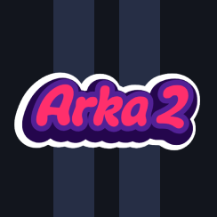 | 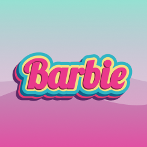 |

| 🍯 Honey | 🕰️ Nostalgia | 🌸 Sherry | 🐆 Leopard | 🌿 Jungle |
|---------|---------------|-----------|------------|----------|
| 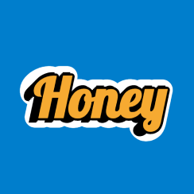 | 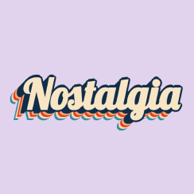 | 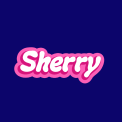 | 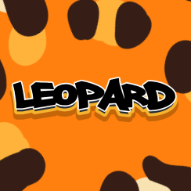 | 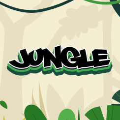 |

> All styles are editable and extendable via JSON — no Flutter coding needed!

## 🤝 How to Get Involved

We believe creativity grows stronger when it's shared. Font Story is built to be shaped by its community — and you're invited to be part of it!

### 🎨 Add Styles (No Coding Needed)

Want to share your own styled text presets? Here’s how:

1. **Fork** the [`font-story-data`](https://github.com/FontStory/font-story-data) repository  
2. Add your new style entry in the `styles.json` file  
3. Place a preview image in the `styles/` folder  
4. Open a Pull Request with a short description and preview

> ✅ You only need basic JSON knowledge — no Flutter required!

### 🔤 Add Fonts

You can also contribute fonts (your own or open-license ones):

1. Add your font file (`.ttf` or `.otf`) to `fonts/{language}/` (e.g. `fonts/persian/`, `fonts/arabic/`, etc.)
2. Register the font in `fonts.json` with the correct metadata
3. Open a Pull Request

> 📦 Make sure any font you submit is properly licensed (open or your own work)

### 🧑‍💻 Contribute to the App (Flutter Code)

If you're a developer and want to improve the Flutter app itself, we’d love your help:

1. **Fork** the [`font-story`](https://github.com/FontStory/font-story) repository  
2. Create a branch: `git checkout -b feature/my-feature`  
3. Commit your changes  
4. Push to your fork  
5. Open a Pull Request with a clear explanation

Bug fixes, performance tweaks, new features, UI polish — it all helps.

> 🌟 All contributors are credited inside the app and in the repositories.  
> Let’s build something beautiful — together.

## 💖 Support the Project

If you love Font Story and want to help us grow, consider supporting our work:

> **☕ Buy us a coffee** to keep the creativity flowing and help us make more open-source tools like this one!

  
  &nbsp;
  

---

  🧚 Built with Flutter and imagination — by the Font Story team

